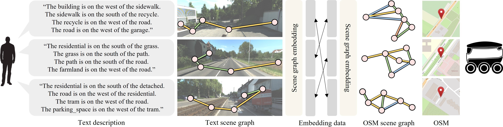
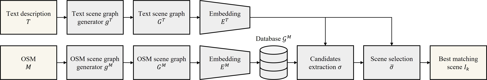

# GOTLoc: General Outdoor Text-based Localization Using Scene Graph Retrieval with OpenStreetMap
#### [[Video 📺]](https://youtu.be/59K14A1NqNw?si=orx-xycsKZd6-zuC), [[Paper 📖]](https://arxiv.org/abs/2501.08575)

[Donghwi Jung](https://donghwijung.github.io/), [Keonwoo Kim](https://www.notion.so/Keonwoo-Kim-743fdb8532e34542bca4172790183849?pvs=4), [Seong-Woo Kim](https://arisnu.squarespace.com/director)

We introduce GOTLoc (General Outdoor Text-based Localization), a localization approach that employs scene graphs to minimize storage requirements and utilizes candidate extraction to enhance processing speed. By utilizing OpenStreetMap data, GOTLoc facilitates efficient outdoor text-based localization without the need for pre-generated maps, ensuring high accuracy and real-time performance for robotic systems.
<p align="center">
  
</p>

## System Overview
<p align="center">
  
</p>

## Setup
### Setting an environments
```bash
conda env create -f environment.yml
conda activate GOTLoc
```
### Install the NLTK
Install the trained pipeline for *word2vec* embeddings.
```bash
pip install spacy
python -m spacy download en_core_web_lg
```
### Install the vectorDB (Milvus)
The vectorDB is required for extracting scene graph candidates. To install it, follow the command below or instructions at [link](https://github.com/milvus-io/milvus). If you're unable to install the vectorDB for any reason, you can skip this step and continue with the code without the candidate extraction by setting the *use_candidates_extraction* in `config.py` as *False*. However, skipping the candidates extraction step will slow down the process.
```bash
pip install -U pymilvus
```
### Setup directories
Create `data` related directories for running the code.
```bash
bash setup_directories.sh
```

## Dataset
- [Download](https://drive.google.com/drive/folders/1oLksAHJl-AUjUM-LIVP5e3i9wMGqhxyl?usp=sharing) scene graphs and model checkpoints. The scene graphs and model checkpoints were created using GPS coordinates derived from the UTM coordinates of the KITTI360Pose dataset.
- Move the downloaded data to the `data` directory.
- Unzip the downloaded data.

## Train
To modify the training arguments, refer to the `config.py` file.
```bash
python train.py
```

## Evaluation
To modify the evaluation arguments, consult the `config.py` file. Additionally, if you have not installed vectorDB (Milvus) as outlined in [Install the vectorDB (Milvus)](#install-the-vectordb-milvus), set this value to *False*.
```bash
python eval.py
```

## Visualization
Select a text scene graph to perform scene retrieval, then visualize the matching text and OSM scene graphs. The index of the text scene graph to be checked can be specified using the `--visualization_graph_index` argument when executing the Python script.
```bash
python visualize_scene_retrieval_results.py --visualization_graph_index <text_graph_index>
# e.g. python visualize_scene_retrieval_results.py ---visualization_graph_index 2500 
```

## Citation
```
@article{jung2025gotloc,
  title={GOTLoc: General Outdoor Text-based Localization Using Scene Graph Retrieval with OpenStreetMap},
  author={Jung, Donghwi and Kim, Keonwoo and Kim, Seong-Woo},
  journal={arXiv preprint arXiv:2501.08575},
  year={2025}
}
```

## Acknowledgements
The codes and datasets in this repository are based on [Where am I?](https://github.com/jiaqchen/whereami-text2sgm), [Milvus](https://github.com/milvus-io/milvus), and [Text2Pos](https://github.com/mako443/Text2Pos-CVPR2022).

## License

Copyright 2025, Donghwi Jung, Keonwoo Kim, Seong-Woo Kim, Autonomous Robot Intelligence Lab, Seoul National University.

This project is free software made available under the MIT License. For details see the LICENSE file.
